<div align="center">

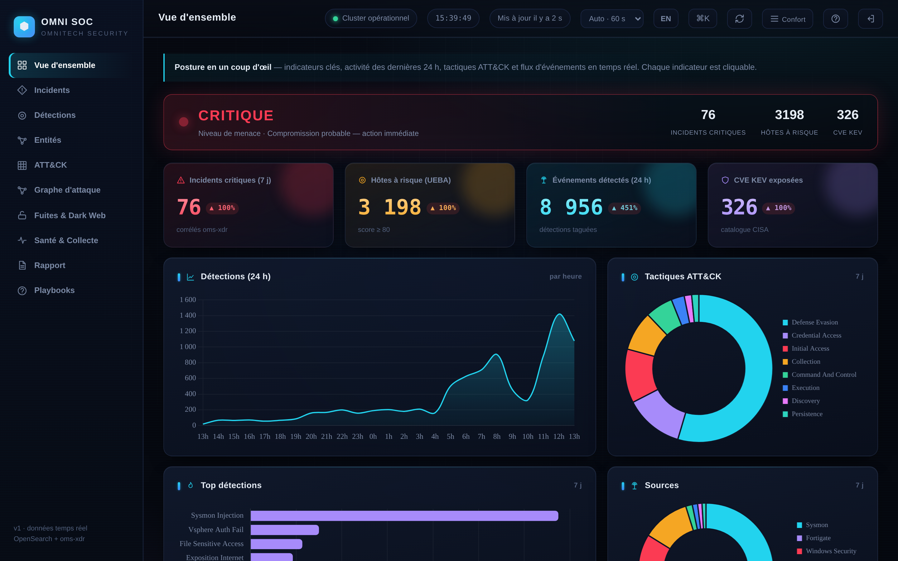

# OMNI SIEM — Detection &amp; Response Platform

**Self‑hosted, production‑grade SIEM, XDR and SOC console — built on Graylog, provisioned entirely as code.**
*Plateforme SIEM / XDR &amp; console SOC auto‑hébergée, de niveau production, bâtie sur Graylog et entièrement provisionnée en code.*

<br>


**🇫🇷 [Français](#-français) · 🇬🇧 [English](#-english) · 🖼️ [Visual tour](#-aperçu-visuel--visual-tour)**

</div>

> ⚠️ **Internal operational repository.** This repo provisions the **production** SIEM of OMNITECH SECURITY — treat it as sensitive infrastructure‑as‑code. Real secrets are **never** committed (see [Security &amp; secrets](#sécurité--secrets)).

---

## 🖼️ Aperçu visuel · Visual tour

> 🔒 Captures **anonymisées** — comptes / hôtes / IP / SID pseudonymisés de façon cohérente (mode `MOBILE_REDACT`).
> *Anonymised screenshots — accounts / hosts / IPs / SIDs consistently pseudonymised.*

### Console SOC « OMNI SOC »

<div align="center">

| | |
|:---:|:---:|
| [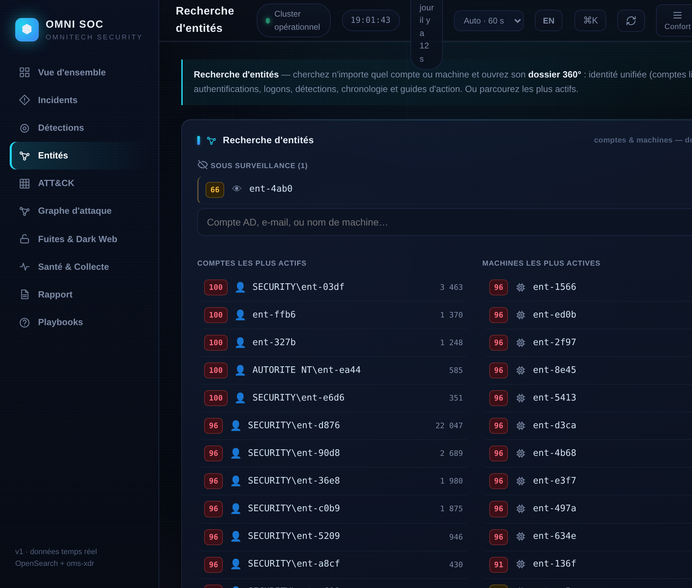](docs/captures/02-entites.png)<br>**Entités** · classées par **risque fusionné** + watchlist<br><sub>*Entities ranked by fused risk + watchlist*</sub> | [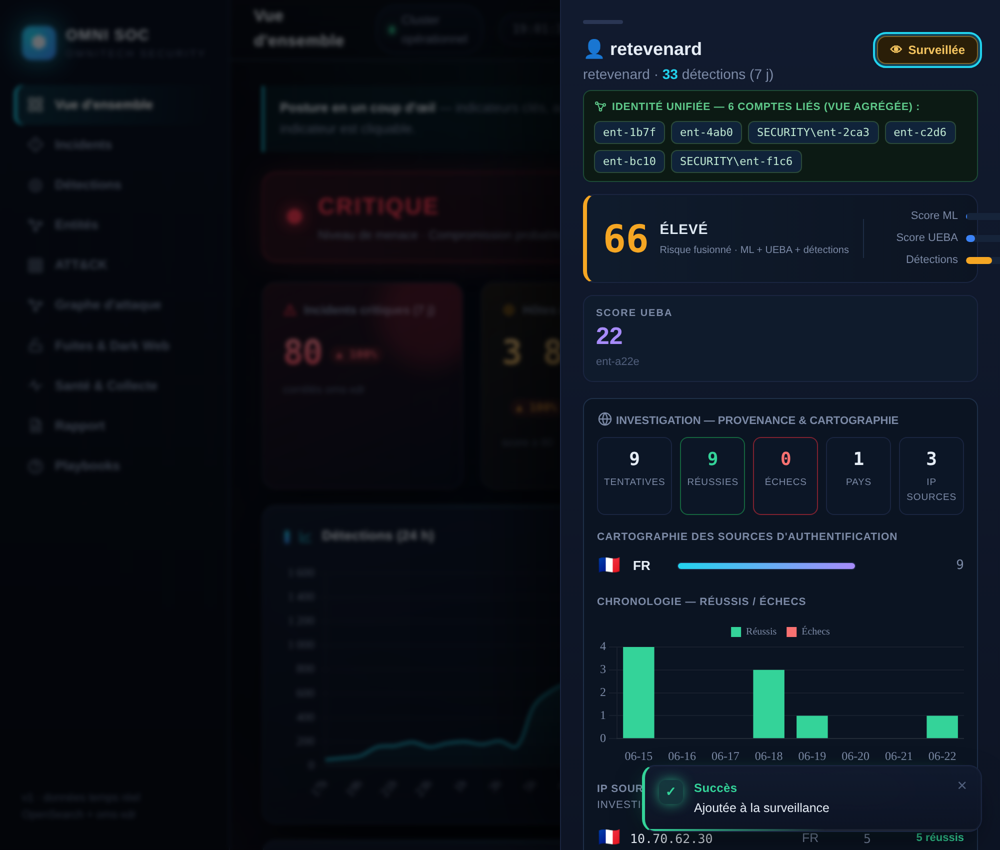](docs/captures/10-dossier360.png)<br>**Dossier 360°** · **jauge de risque fusionné**, identité unifiée, provenance & cartographie<br><sub>*Fused-risk gauge, unified identity, provenance*</sub> |
| [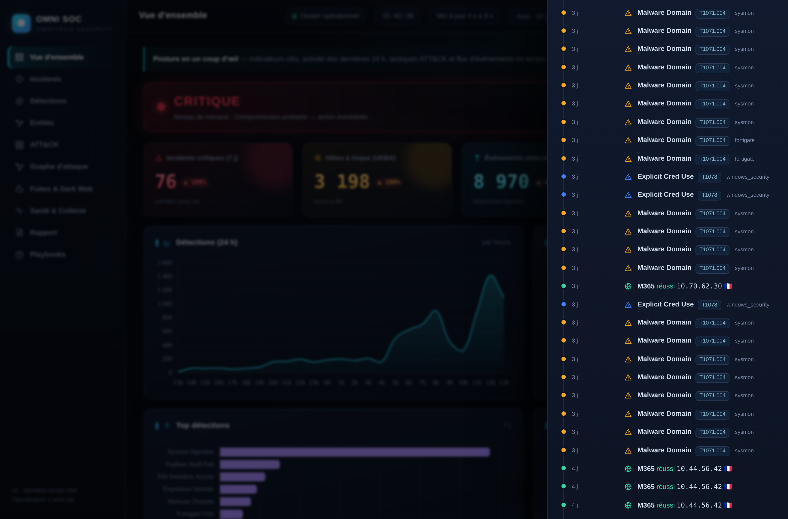](docs/captures/10b-timeline.png)<br>**Chronologie unifiée** · détections + authentifications, par date<br><sub>*Unified timeline — detections + auth*</sub> | [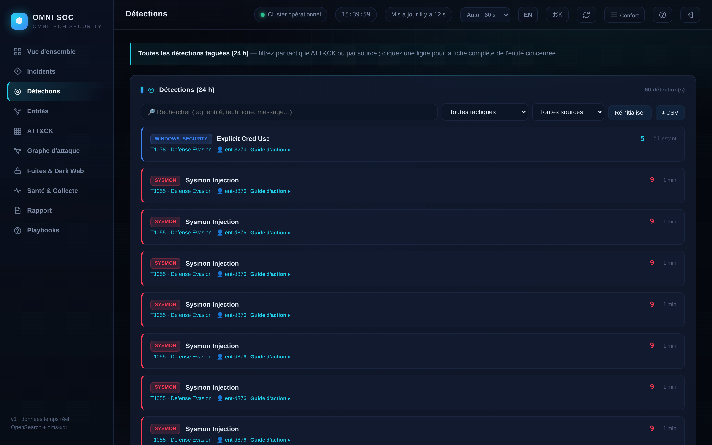](docs/captures/04-detections.png)<br>**Détections** · liste 24 h + **guide d'action** intégré<br><sub>*Detections + inline action guide*</sub> |
| [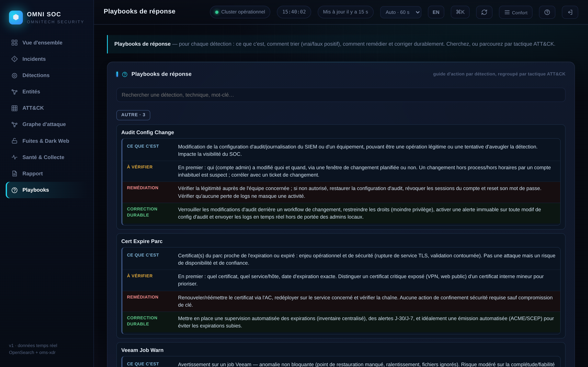](docs/captures/05-playbooks.png)<br>**Playbooks** · ce que c'est / vérifier / remédier / corriger<br><sub>*4‑part response playbooks*</sub> | [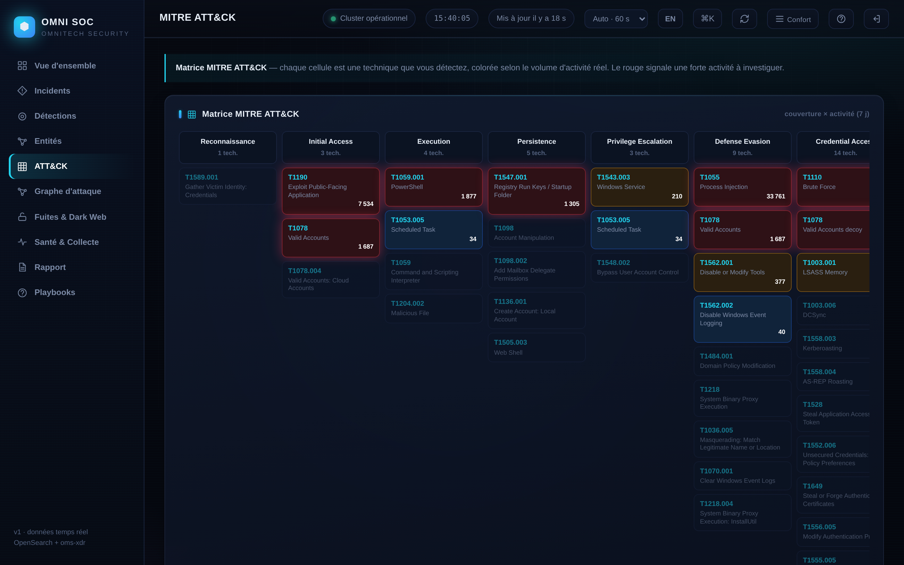](docs/captures/06-attack.png)<br>**Matrice MITRE ATT&CK** · couverture × activité<br><sub>*ATT&CK coverage matrix*</sub> |
| [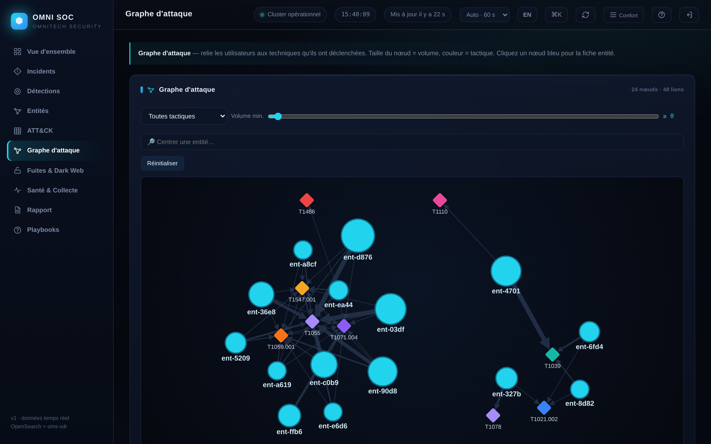](docs/captures/07-graphe.png)<br>**Graphe d'attaque** · entités ↔ techniques<br><sub>*Attack graph*</sub> | [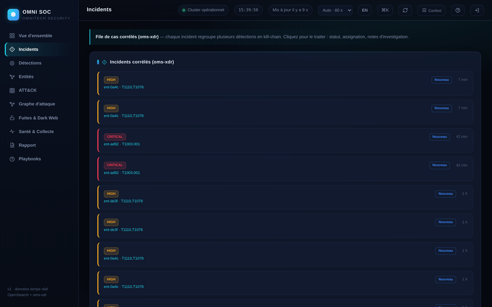](docs/captures/03-incidents.png)<br>**Incidents** · cas corrélés (oms‑xdr)<br><sub>*Correlated incidents*</sub> |
| [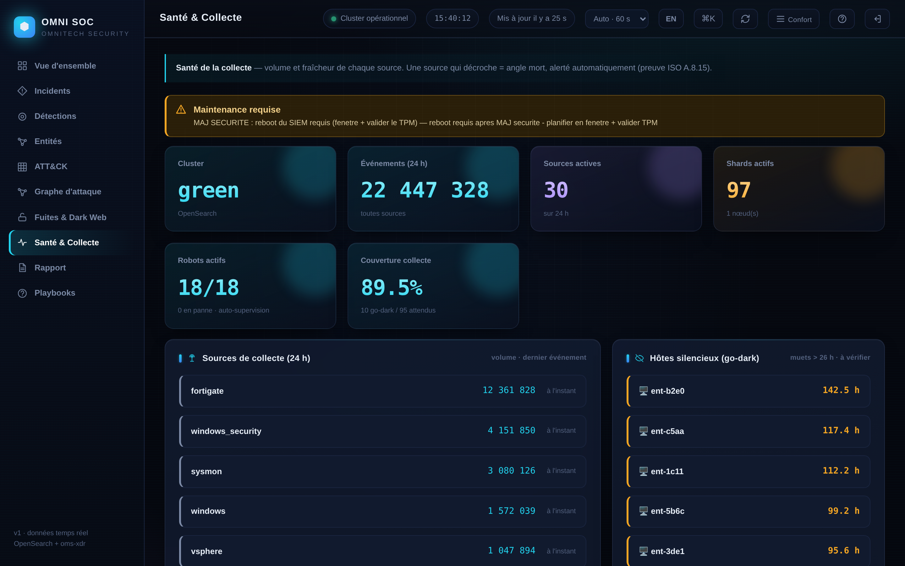](docs/captures/08-sante.png)<br>**Santé & collecte** · cluster, SLA, santé des robots<br><sub>*Health, SLA & robot supervision*</sub> | [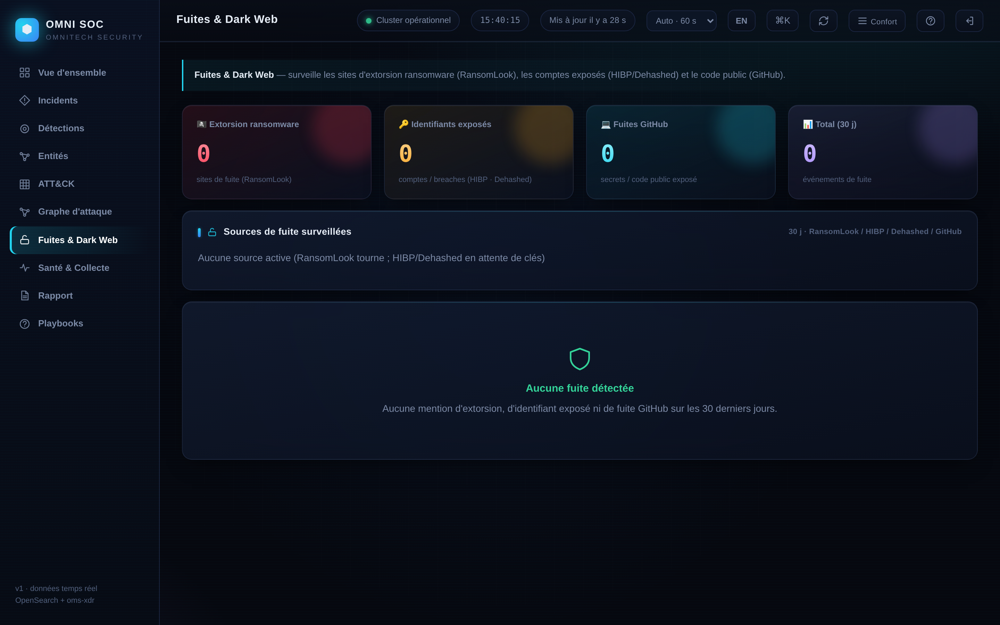](docs/captures/09-fuites.png)<br>**Fuites & Dark Web** · RansomLook / HIBP / Dehashed / GitHub<br><sub>*Leaks & dark‑web monitoring*</sub> |

[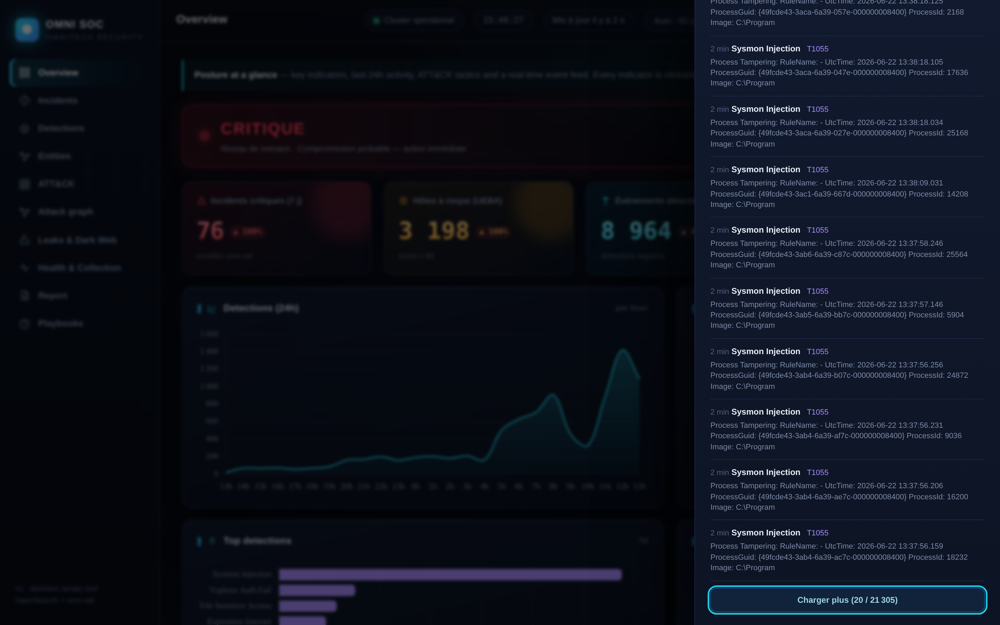](docs/captures/11-overview-en.png)

***Interface bilingue FR / EN*** — bascule instantanée et persistée. *Bilingual FR / EN UI, instant & persisted toggle.*

</div>

### PWA mobile — *application installable, notifications web‑push*

<div align="center">

| | |
|:---:|:---:|
| [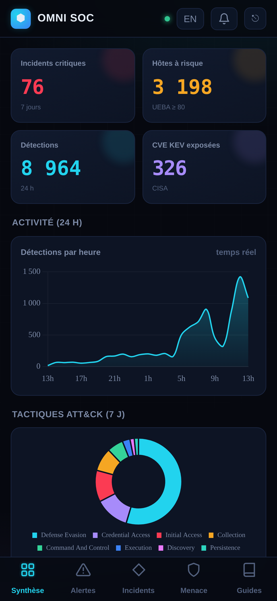](docs/captures/12-pwa-mobile.png)<br>**Menace** · parité console (ML / UEBA)<br><sub>*Threat — console parity*</sub> | [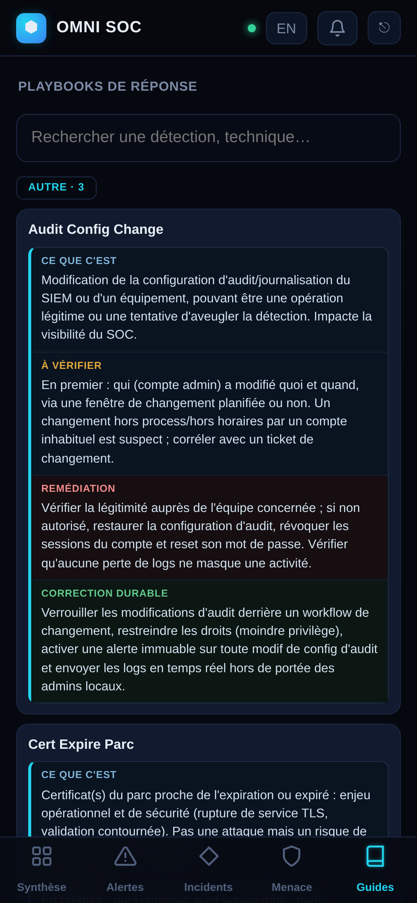](docs/captures/13-pwa-guides.png)<br>**Guides** · playbooks par tactique<br><sub>*Guides — playbooks by tactic*</sub> |

</div>

---

## 🇫🇷 Français

### Vue d'ensemble

Plateforme **SIEM + XDR + console SOC** complète et reproductible, déployée sur une VM Debian durcie, avec un kit d'enrôlement Windows/AD. Elle collecte Windows Security/Sysmon, FortiGate/FortiAnalyzer, Microsoft 365, vSphere, ESET, Vaultwarden et Veeam ; normalise tout dans un **schéma commun** ; exécute **177 règles de pipeline** et **114 définitions d'alerte** mappées **MITRE ATT&CK** ; ajoute **analyse comportementale (UEBA/NDR)**, **scoring ML (`oms-ml`)**, **corrélation d'incidents kill‑chain (`oms-xdr`)**, **SOAR léger**, une **console SOC web + PWA mobile** bilingue, et **70 playbooks d'action** — le tout provisionné par des scripts **idempotents** et documenté pour l'**audit ISO 27001:2022**.

> *Tout est code.* Chaque script est rejouable sans danger et s'arrête à la première erreur, contrôle final à l'appui.

### Capacités clés

| Capacité | Rôle |
|---|---|
| 🛡️ **Detection engineering** | **177 règles** de pipeline sur 7 streams (AD/Sysmon, FortiGate, FortiManager, M365, vSphere…) → événements tagués (`alert_tag`) + **114 définitions d'alerte** (mail + Teams), fenêtres glissantes |
| 🎯 **MITRE ATT&CK** | `alert_tag` → techniques / tactiques, score de risque 0–10, couche ATT&CK Navigator + **matrice de couverture interactive** |
| 🔎 **Recherche d'entités & dossier 360°** | Page dédiée : **tout compte ou machine** → identité unifiée, authentifications, logons, détections, **chronologie**, guides ; **score de risque FUSIONNÉ** (ML+UEBA+sévérité), entités **classées par risque**, **watchlist** de suivi |
| 🧬 **Corrélation d'identité** | `SECURITY\rdupont`, `adm-rdupont`, `rdupont@dom` reconnus comme **une seule personne** (comptes liés agrégés) ; machines jamais fusionnées |
| 🕑 **Chronologie unifiée** | Le **récit** d'une entité : détections + échecs d'auth Windows + sign‑ins M365 fusionnés et triés par date, sur tous les comptes liés |
| 🧠 **XDR & LLM local** | `oms-xdr` : corrélation kill‑chain multi‑sources, scoring d'incident, triage/narration par LLM **local** (Ollama, CPU), réponse en **dry‑run** (double verrou) |
| 📈 **UEBA / NDR** | Z‑score de volume, voyage impossible (Haversine), beaconing C2 (CV des intervalles), tunnel DNS (entropie), scan interne, score de risque d'entité 0–100 |
| 🤖 **ML (`oms-ml`)** | Anomalie **non‑supervisée** (IsolationForest) en direct + réduction de **faux positifs** supervisée (features contextuelles par entité) |
| 📖 **Playbooks & alertes auto‑explicatives** | **70 playbooks** (ce que c'est / vérifier / remédier / corriger) + chaque alerte porte cause décodée, EventID, ATT&CK et risque ; guide d'action **intégré** à chaque détection |
| 🌐 **Threat intel & fuites** | abuse.ch (C2 Feodo / domaines URLhaus, **qualité TI** : infra partagée écartée), CISA KEV + ancienneté de patch ; RansomLook, HIBP, Dehashed, GitHub |
| ⚙️ **SOAR & réponse** | Blocage auto des IP attaquantes sur FortiGate (sans identifiant, TTL, liste blanche, audit) ; désactivation de compte AD via LDAPS (**dry‑run** + denylist + audit + validation humaine) |
| ✅ **Précision (~0 % FP visé)** | Tuning FP **mesuré et vérifié adversarialement** (allowlists chemin‑ancrées, garde‑fous anti‑faux‑négatif) ; auto‑supervision des **34 robots** ; chaîne d'intégrité HMAC |
| 📋 **Conformité & intégrité** | Rétention par paliers, chaîne anti‑altération (`omni-integrity`), registre d'amélioration continue (clause 10) + générateur de preuves daté, mapping ISO 27001:2022 |

### Architecture

```
 Postes / Serveurs ───Winlogbeat TLS 5044──┐      GPO OMNI-AUDIT-Baseline (DC)
 (Sysmon + audit GPO)                       │      + distribution NETLOGON\SIEM (NinjaOne)
                                            ▼
 FortiGate ─► FortiAnalyzer ──syslog/CEF 1514/5555──►  ┌────────────────────────────┐
                                                       │  bx-it-graylog-vm           │
 Microsoft 365 ──Graph API (pull)──────────────────────│  Nginx TLS :443             │
 vSphere ──────syslog 1516─────────────────────────────│   ├─ Graylog 7.1 :9000 (TLS)│
 ESET PROTECT ─syslog 1515─────────────────────────────│   ├─ OpenSearch 2.19 :9200  │
 Vaultwarden / Veeam ──Filebeat / canal────────────────│   ├─ MongoDB 8.0 rs0        │
 Admins / SOC ─────HTTPS 443 (VPN)─────────────────────│   └─ Console SOC + PWA (8090)│
                                                        └────────────────────────────┘
        │                                                          │ GELF :12201
        │   34 microservices Python (/usr/local/sbin/omni-*)       │ (event_source=siem_*)
        └──  UEBA · NDR · oms-ml · oms-xdr · SOAR · rapports ──────┘
```

### Organisation du dépôt

| Chemin | Contenu |
|---|---|
| `00–09*.sh` | OS de base, MongoDB, OpenSearch, Graylog, Nginx/TLS, pare‑feu, inputs, sauvegarde, SNMP |
| `10–14*.sh` | Modèle de données, enrichissement, **pipelines**, alertes, tableaux de bord |
| `15–22*.sh` | Rapports, M365, vSphere, hygiène & routage des alertes |
| `30–85*.sh` | Résilience, rétention/ISO, LDAPS, **SOAR**, **MITRE**, **UEBA/NDR**, scan vuln, corrélation, intégrité, **allowlists FP**, détections additionnelles |
| `oms-ml/` · `oms-xdr/` | Couche ML (anomalie + réduction FP) · moteur de corrélation XDR |
| `mobile/` | Backend console SOC + **PWA** (`omni-mobile-api.py`, stdlib), front `soc/` & `www/` |
| `lib-graylog.sh` | Helpers API Graylog (TLS, `ensure_rule`/`ensure_pipeline`, `wrap_entity`…) |
| `windows/` · `fortigate/` | GPO d'audit AD + kit agent · durcissement UTM/VPN FortiGate |
| `lookups/` | Tables CSV (EventID, MITRE, **`alert-guidance.json`**…) |
| `docs/` | Politique/standards/procédures ISO 27001, architecture, PRA, registres & captures |
| `00-vars.env.example` · `SECRETS.example.md` | **Gabarits** de configuration & de secrets (valeurs réelles jamais versionnées) |

### Démarrage rapide

```bash
cd omnitech-siem-setup && chmod +x *.sh
cp 00-vars.env.example 00-vars.env && chmod 600 00-vars.env && $EDITOR 00-vars.env  # secrets CHANGEME

./00-preflight.sh --gen-vars   # analyse l'hôte : AVX, RAM, disques, réseau, dépôts, ports
./01-base.sh ./02-mongodb.sh ./03-opensearch.sh ./04-graylog.sh ./05-nginx-tls.sh
./06-firewall.sh ./07-inputs.sh ./10-graylog-model.sh … ./14-graylog-dashboards.sh
#  … puis les scripts fonctionnels (MITRE, UEBA/NDR, SOAR, oms-ml, oms-xdr, console…)
```

Console : `https://bx-it-graylog-vm.omnitech.security/soc/` (VPN). Volet Windows/AD : `windows/README-WINDOWS.md`.

### Sécurité & secrets

- **Aucun secret n'est versionné.** `.gitignore` exclut `00-vars.env`, `SECRETS.md`, tous les `*.key`/`*.pem`/`*.cred`/certificats. Utiliser les gabarits `*.example`.
- Secrets de service dans `00-vars.env` (`chmod 600`) ; clés TLS, keyfile Mongo, `password_secret` Graylog sous `/etc` `/root` avec permissions strictes.
- Services internes en `127.0.0.1` uniquement (OpenSearch, MongoDB, API Graylog, backend console) ; seuls Nginx (443) et les inputs sont exposés, derrière nftables + FortiGate.
- **`/data` chiffré au repos** (LUKS2/TPM2) ; captures de démonstration **pseudonymisées** (`MOBILE_REDACT`).

### Conformité ISO 27001:2022

Preuves Annexe A produites par la plateforme : **A.8.15/8.16** (journalisation & surveillance), **A.8.8** (vulnérabilités), **A.5.7** (renseignement menaces), **A.8.11** (masquage), **A.5.25/5.26** (réponse à incident), **A.8.13** (sauvegarde), **A.5.37 / A.8.32** (procédures & gestion du changement — ce dépôt), **Clause 10** (amélioration continue). Dossier complet dans `docs/`.

### État & feuille de route

**Production.** **Livré :** corrélation XDR + triage LLM local (`oms-xdr`), scoring **ML** (`oms-ml`), **console SOC + PWA** bilingues (recherche d'entités, dossier 360°, chronologie unifiée, corrélation d'identité, **70 playbooks** intégrés, scores ML/UEBA, graphe d'attaque, SLA collecte/santé robots), threat‑intel **qualité‑filtrée** + surveillance fuites, matrice ATT&CK, actionneur AD (dry‑run), registre clause 10. **À venir :** isolation d'endpoint ESET + armement de la réponse AD (en attente accès API / délégation), couche LLM cloud optionnelle (conseil) avec tokenisation déterministe.

---

## 🇬🇧 English

### Overview

A complete, reproducible **SIEM + XDR + SOC console** deployed on a single hardened Debian VM, with a Windows/AD enrolment kit. It ingests Windows Security/Sysmon, FortiGate/FortiAnalyzer, Microsoft 365, vSphere, ESET, Vaultwarden and Veeam; normalises everything into a **common schema**; runs **177 pipeline rules** and **114 alert definitions** mapped to **MITRE ATT&CK**; adds **behavioural analytics (UEBA/NDR)**, an **ML scoring layer (`oms-ml`)**, **kill‑chain incident correlation (`oms-xdr`)**, **light SOAR**, a bilingual **SOC web console + mobile PWA**, and **70 action playbooks** — all provisioned by **idempotent** scripts and documented for **ISO 27001:2022** evidence.

> *Everything is code.* Every script is safe to re‑run and stops on first error with a final check.

### Key capabilities

| Capability | What it does |
|---|---|
| 🛡️ **Detection engineering** | **177 pipeline rules** across 7 streams (AD/Sysmon, FortiGate, FortiManager, M365, vSphere…) → tagged events + **114 alert definitions** (mail + Teams), tumbling windows |
| 🎯 **MITRE ATT&CK** | `alert_tag` → techniques / tactics, 0–10 risk score, ATT&CK Navigator layer + **interactive coverage matrix** |
| 🔎 **Entity search & 360° dossier** | Dedicated page: **any account or machine** → unified identity, authentications, logons, detections, **timeline**, guides; **FUSED risk score** (ML+UEBA+severity), entities **ranked by risk**, follow-up **watchlist** |
| 🧬 **Identity correlation** | `SECURITY\jdoe`, `adm-jdoe`, `jdoe@dom` recognised as **one person** (linked accounts aggregated); machines never merged |
| 🕑 **Unified timeline** | An entity's **story**: detections + Windows auth failures + M365 sign‑ins merged and time‑sorted, across all linked accounts |
| 🧠 **XDR & local LLM** | `oms-xdr`: cross‑source kill‑chain correlation, incident scoring, **local** LLM triage/narration (Ollama, CPU), **dry‑run** response (double‑lock) |
| 📈 **UEBA / NDR** | Volume Z‑score, impossible travel (Haversine), C2 beaconing (interval CV), DNS tunnelling (entropy), internal scan, entity risk 0–100 |
| 🤖 **ML (`oms-ml`)** | Live **unsupervised** anomaly (IsolationForest) + supervised **false‑positive reduction** (per‑entity contextual features) |
| 📖 **Playbooks & self‑explaining alerts** | **70 playbooks** (what it is / triage / remediate / harden) + every alert carries decoded cause, EventID, ATT&CK and risk; action guide **inline** on each detection |
| 🌐 **Threat intel & leaks** | abuse.ch (Feodo C2 / URLhaus domains, **TI‑quality**: shared infra excluded), CISA KEV + patch‑age; RansomLook, HIBP, Dehashed, GitHub |
| ⚙️ **SOAR & response** | Threat‑feed auto‑block of attacker IPs on FortiGate (no creds, TTL, allowlist, audit); AD account disable via LDAPS (**dry‑run** + denylist + audit + human‑in‑the‑loop) |
| ✅ **Precision (targeting ~0 % FP)** | FP tuning **measured & adversarially verified** (path‑anchored allowlists, anti‑false‑negative guards); self‑supervision of the **34 robots**; tamper‑evident HMAC chain |
| 📋 **Compliance & integrity** | Tiered retention, tamper‑evident chain (`omni-integrity`), continual‑improvement register (clause 10) + dated evidence generator, full ISO 27001:2022 mapping |

### Architecture

```
 Endpoints / Servers ──Winlogbeat TLS 5044──┐      GPO OMNI-AUDIT-Baseline (DC)
 (Sysmon + audit GPO)                        │      + NETLOGON\SIEM distribution (NinjaOne)
                                             ▼
 FortiGate ─► FortiAnalyzer ──syslog/CEF 1514/5555──►  ┌────────────────────────────┐
                                                       │  bx-it-graylog-vm           │
 Microsoft 365 ──Graph API (pull)──────────────────────│  Nginx TLS :443             │
 vSphere ──────syslog 1516─────────────────────────────│   ├─ Graylog 7.1 :9000 (TLS)│
 ESET PROTECT ─syslog 1515─────────────────────────────│   ├─ OpenSearch 2.19 :9200  │
 Vaultwarden / Veeam ──Filebeat / channel──────────────│   ├─ MongoDB 8.0 rs0        │
 Admins / SOC ─────HTTPS 443 (VPN)─────────────────────│   └─ SOC console + PWA (8090)│
                                                        └────────────────────────────┘
        │                                                          │ GELF :12201
        │   34 Python microservices (/usr/local/sbin/omni-*)       │ (event_source=siem_*)
        └──  UEBA · NDR · oms-ml · oms-xdr · SOAR · reports ───────┘
```

### Repository layout

| Path | Contents |
|---|---|
| `00–09*.sh` | Base OS, MongoDB, OpenSearch, Graylog, Nginx/TLS, firewall, inputs, backup, SNMP |
| `10–14*.sh` | Data model, enrichment, **pipelines**, alerts, dashboards |
| `15–22*.sh` | Reports, M365, vSphere, alert hygiene &amp; routing |
| `30–85*.sh` | Resilience, retention/ISO, LDAPS, **SOAR**, **MITRE**, **UEBA/NDR**, vuln scan, correlation, integrity, **FP allowlists**, extra detections |
| `oms-ml/` · `oms-xdr/` | ML layer (anomaly + FP reduction) · XDR correlation engine |
| `mobile/` | SOC console + **PWA** backend (`omni-mobile-api.py`, stdlib), `soc/` &amp; `www/` front‑ends |
| `lib-graylog.sh` | Graylog API helpers (TLS, `ensure_rule`/`ensure_pipeline`, `wrap_entity`…) |
| `windows/` · `fortigate/` | AD audit GPO + agent kit · FortiGate UTM/VPN hardening |
| `lookups/` | CSV lookups (EventID, MITRE, **`alert-guidance.json`**…) |
| `docs/` | ISO 27001 policy/standards/procedures, architecture, DRP, registers &amp; screenshots |
| `00-vars.env.example` · `SECRETS.example.md` | Configuration &amp; secret **templates** (real values never committed) |

### Quick start

```bash
cd omnitech-siem-setup && chmod +x *.sh
cp 00-vars.env.example 00-vars.env && chmod 600 00-vars.env && $EDITOR 00-vars.env  # CHANGEME secrets

./00-preflight.sh --gen-vars   # analyse host: AVX, RAM, disks, network, repos, ports
./01-base.sh ./02-mongodb.sh ./03-opensearch.sh ./04-graylog.sh ./05-nginx-tls.sh
./06-firewall.sh ./07-inputs.sh ./10-graylog-model.sh … ./14-graylog-dashboards.sh
#  … then the feature scripts (MITRE, UEBA/NDR, SOAR, oms-ml, oms-xdr, console…)
```

Console: `https://bx-it-graylog-vm.omnitech.security/soc/` (VPN). Windows/AD side: `windows/README-WINDOWS.md`.

### Security &amp; secrets

- **No secret is ever committed.** `.gitignore` excludes `00-vars.env`, `SECRETS.md`, all `*.key`/`*.pem`/`*.cred`/certs. Use the `*.example` templates.
- Service secrets live in `00-vars.env` (`chmod 600`); TLS keys, Mongo keyfile and Graylog `password_secret` under `/etc` `/root` with strict permissions.
- Internal services bind to `127.0.0.1` only (OpenSearch, MongoDB, Graylog API, console backend); only Nginx (443) and the inputs are exposed, behind nftables + FortiGate.
- **`/data` encrypted at rest** (LUKS2/TPM2); demo screenshots are **pseudonymised** (`MOBILE_REDACT`).

### ISO 27001:2022 alignment

Annex A evidence produced by the platform: **A.8.15/8.16** (logging &amp; monitoring), **A.8.8** (vulnerabilities), **A.5.7** (threat intelligence), **A.8.11** (data masking), **A.5.25/5.26** (incident response), **A.8.13** (backup), **A.5.37 / A.8.32** (operating procedures &amp; change management — this repo), **Clause 10** (continual improvement). Full set in `docs/`.

### Status &amp; roadmap

**Production.** **Delivered:** XDR correlation + local LLM triage (`oms-xdr`), **ML** scoring (`oms-ml`), bilingual **SOC console + PWA** (entity search, 360° dossier, unified timeline, identity correlation, **70 inline playbooks**, ML/UEBA scores, attack graph, collection‑SLA / robot health), **quality‑filtered** threat‑intel + leak monitoring, ATT&CK coverage matrix, AD actuator (dry‑run), clause‑10 register. **Next:** ESET endpoint isolation + arming the AD response (pending API access / AD delegation), optional cloud‑LLM advisory layer with deterministic tokenisation.

### Stack &amp; versions (pinned)

Debian 13 · Graylog 7.1 · OpenSearch 2.19.x (3.x breaks Graylog) · MongoDB 8.0 · Winlogbeat OSS 8.x. Controlled upgrades only: `apt-mark unhold` → check Graylog matrix → upgrade → re‑hold.

---

<div align="center">
<sub>OMNITECH SECURITY — internal SIEM / XDR platform · provisioned by idempotent scripts · secrets excluded by design.</sub>
</div>
